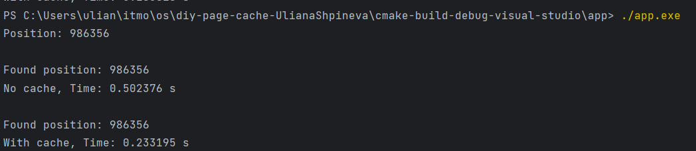
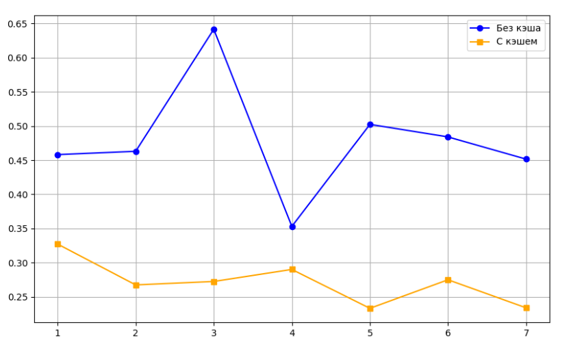

# Лабораторная работа №2 по ОС
## Отчёт

* Выполнила: Шпинева Ульяна Сергеевна, P3316
* Преподаватель: Гиниятуллин Арслан Рафаилович
* Вариант: `Windows LFU`

## Задание

Для оптимизации работы с блочными устройствами в ОС существует кэш страниц с данными, которыми мы производим операции чтения и записи на диск. Такой кэш позволяет избежать высоких задержек при повторном доступе к данным, так как операция будет выполнена с данными в RAM, а не на диске (вспомним пирамиду памяти).

В данной лабораторной работе необходимо реализовать блочный кэш в пространстве пользователя в виде динамической библиотеки (dll или so). Политику вытеснения страниц и другие элементы задания необходимо получить у преподавателя.

При выполнении работы необходимо реализовать простой API для работы с файлами, предоставляющий пользователю следующие возможности:

- Открытие файла по заданному пути файла, доступного для чтения. Процедура возвращает некоторый хэндл на файл. Пример:
  
    int lab2_open(const char *path);

- Закрытие файла по хэндлу. Пример:
  
    int lab2_close(int fd);

- Чтение данных из файла. Пример:
  
    ssize_t lab2_read(int fd, void buf[.count], size_t count);

- Запись данных в файл. Пример:
  
    ssize_t lab2_write(int fd, const void buf[.count], size_t count);

- Перестановка позиции указателя на данные файла. Достаточно поддержать только абсолютные координаты. Пример:
 
    off_t lab2_lseek(int fd, off_t offset, int whence);
 
- Синхронизация данных из кэша с диском. Пример:
  
    int lab2_fsync(int fd);

Операции с диском разработанного блочного кеша должны производиться в обход page cache используемой ОС.

В рамках проверки работоспособности разработанного блочного кэша необходимо адаптировать указанную преподавателем программу-загрузчик из ЛР 1, добавив использование кэша. Запустите программу и убедитесь, что она корректно работает. Сравните производительность до и после.

## Реализация

Я сделала блочный кэш, который вытесняет блоки по алгоритму LFU, исходный код реализации в cache.cpp. Также реализовала API для работы с файлами, который использует мой кэш в обход системного. Модуль cache собирается в DLL библиотеку с доступными функциями из cache_api.h:

- int lab2_open(const char *path);
- int lab2_close(int fd);
- int lab2_write(int fd, const void *buf, size_t count);
- int lab2_read(int fd, void *buf, size_t count);
- off_t lab2_lseek(int fd, off_t offset, int whence);
- int lab2_fsync(int fd);

В файле app.cpp 2 реализации бенчмарка ema-search-int: с использованием моего кэша и без. Я убрала из реализации бенчмарка из первой лабораторной работы рандомную установку позиции искомого значения, чтобы точно сравнить результат работы 2 вариантов.

## Результат

Пример вывода:

График по результатам нескольких запусков:

## Вывод
По результатам работы программы видно, что нагрузчик, использующий реализованный кэш, работает быстрее примерно в 2 раза

